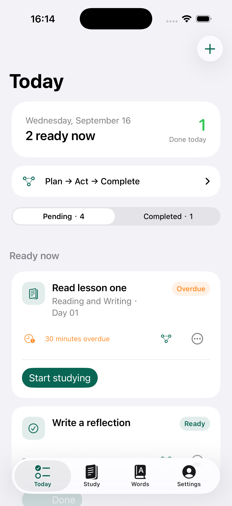
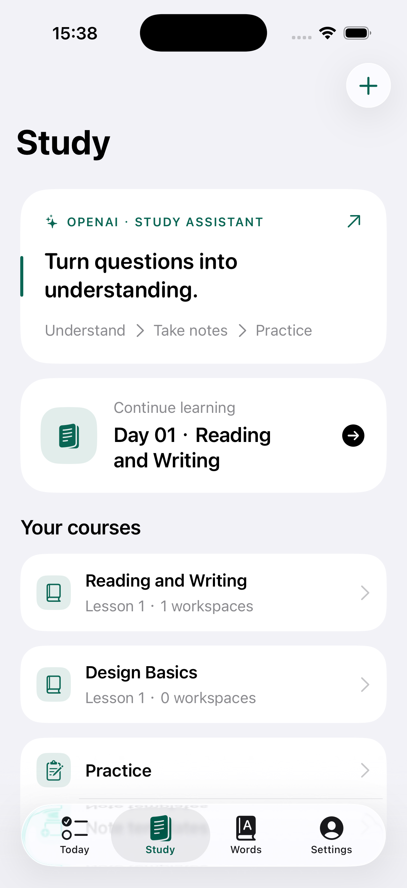
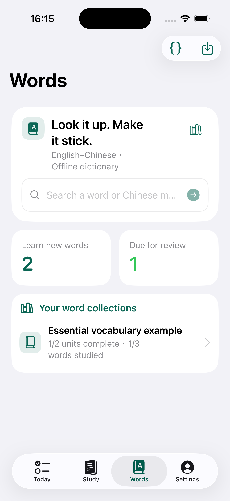
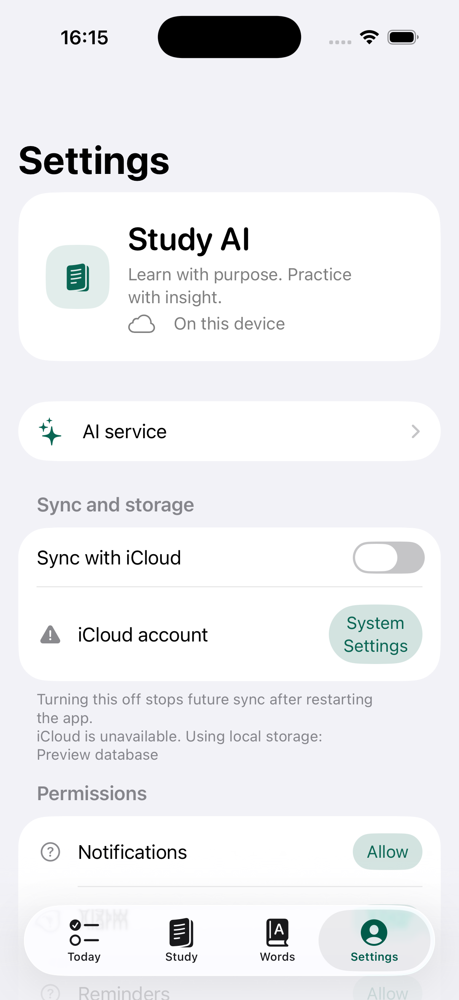
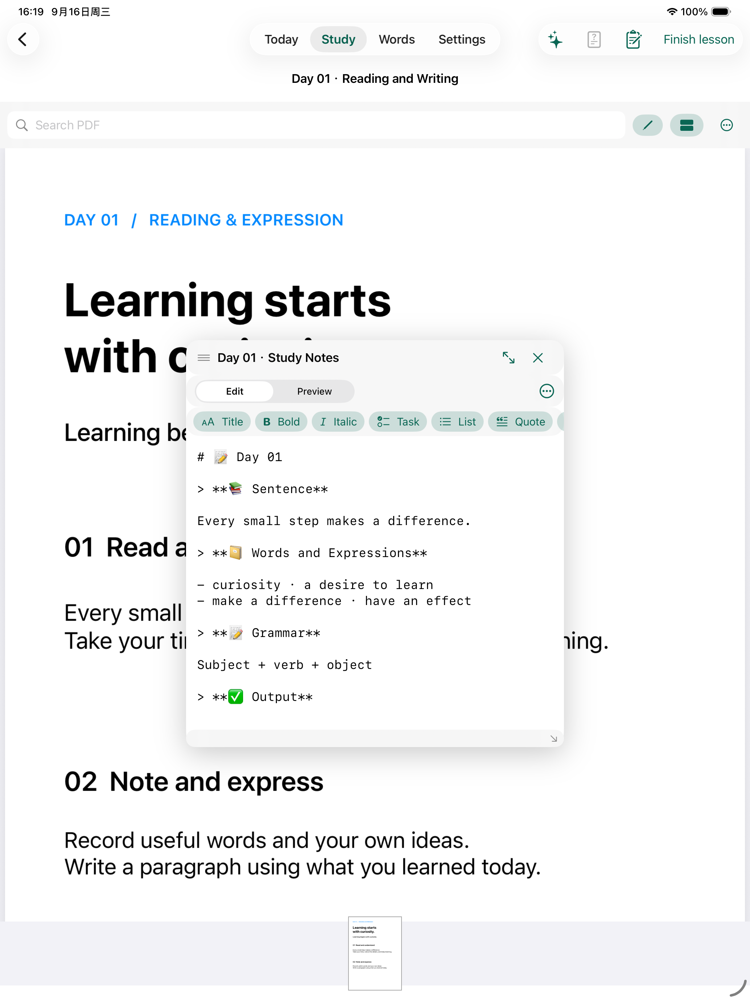

<p align="center">
  
</p>

<h1 align="center">Study AI</h1>

<p align="center">
  A calm, local-first study workspace for iPhone and iPad.
  <br />
  Plan the work. Understand the material. Keep the progress.
</p>

<p align="center">
  <a href="#-features">Features</a>
  &nbsp;&middot;&nbsp;
  <a href="#-openai-integration">OpenAI integration</a>
  &nbsp;&middot;&nbsp;
  <a href="#-build-locally">Build locally</a>
  &nbsp;&middot;&nbsp;
  <a href="Docs/OpenAI-Implementation.md">Implementation notes</a>
  &nbsp;&middot;&nbsp;
  <a href="Docs/privacy-policy.html">Privacy policy</a>
</p>

<p align="center">
  
  
  
  
</p>

<p align="center">
  <sub>OpenAI-powered, but not an official OpenAI product.</sub>
</p>

## Table of contents

- [What is Study AI?](#-what-is-study-ai)
- [Features](#-features)
  - [Today](#today)
  - [Study](#study)
  - [Words](#words)
  - [Study assistant](#study-assistant)
- [The learning loop](#-the-learning-loop)
- [Screenshots](#-screenshots)
- [OpenAI integration](#-openai-integration)
- [Privacy and data boundaries](#-privacy-and-data-boundaries)
- [Privacy, identity, and license](#-privacy-identity-and-license)
- [Supported formats](#-supported-formats)
- [Build locally](#-build-locally)
- [Repository map](#-repository-map)
- [Roadmap](#-roadmap)
- [Contributing](#-contributing)

## 🔭 What is Study AI?

Study AI is a personal study system built around the complete learning loop rather than a collection of disconnected tools:

> **Plan → Study → Capture → Practice → Review**

It brings configurable tasks, course workspaces, PDF study, Markdown notes, structured assignments, offline dictionaries, spaced repetition, and optional AI assistance into one iOS/iPadOS app.

The first use case is English learning, but the task engine and study model are intentionally generic. The same workflow can support reading, mathematics, programming, certification preparation, or any course built from user-provided material.

## ✨ Features

### Today

Today is an action-oriented task board, not a hard-coded daily checklist.

- Build tasks from reusable action types and parameters.
- Add dependencies, recurrence, overdue behavior, and completion rules.
- Schedule Apple system alarms, in-app notifications, and Apple Reminders actions.
- Keep the app as the source of truth for completion.
- Edit or delete tasks, remove completed history, and inspect the workflow diagram.

### Study

Study keeps the source material and the learner's notes in the same workspace.

- Create one workspace and one main note per lesson by default.
- Read PDFs with search, text selection, copy, OCR, question extraction, and PencilKit markup.
- Keep annotations independent from the original PDF and export an annotated copy.
- Open a movable, resizable Markdown note beside the material on iPad and in a controlled sheet on iPhone.
- Import structured assignments, answer them locally, submit, grade, review explanations, and reset for another attempt.

### Words

Words is an offline vocabulary and dictionary workspace.

- Search English to Chinese and Chinese to English without a network request.
- Show parts of speech, senses, inflections, phrases, idioms, related words, IPA, and device speech when available.
- Import generic vocabulary courseware units and organize them by any user-defined group.
- Practice with initial ratings and spaced repetition.
- Keep dictionary files and indexes on the device.

### Study assistant

The assistant is a focused study companion, not a general chat surface.

- Explain selected text from a lesson or PDF.
- Break a sentence into concrete chunks and grammar roles.
- Preserve the source context and validate quoted text.
- Append a reviewed explanation to the active note.
- Generate a small practice set that is previewed and validated before saving.
- Leave local grading and task completion deterministic.

## 🔁 The learning loop

| Stage | What happens | Result |
| --- | --- | --- |
| **Plan** | Create an actionable task with timing, dependencies, and reminders. | A clear next action. |
| **Study** | Open the course workspace and work through the source material. | Understanding in context. |
| **Capture** | Write in the Markdown note or append a reviewed AI explanation. | A durable personal record. |
| **Practice** | Complete the assignment or vocabulary session. | Observable evidence of learning. |
| **Review** | Revisit notes, missed answers, and spaced-repetition items. | Retention over time. |

## 🖼️ Screenshots

<p align="center">
  
  
  
  
</p>

<p align="center">
  
</p>

<p align="center">
  <sub>UI review captures are simulator evidence. Physical-device alarms, Pencil behavior, signing, and iCloud sync still require device verification.</sub>
</p>

## 🤖 OpenAI integration

Study AI calls the OpenAI Responses API directly from the device with a key supplied by the user.

- No developer backend, proxy, shared embedded key, or account system is required.
- The endpoint, model, output limit, selected text, and privacy/cost implications are shown before a request.
- Keys are stored in the current device's Keychain.
- Requests are HTTPS-only, size-limited, and never sent automatically from background tasks.
- Responses are validated before they can be appended to notes or imported as practice.
- AI feedback never changes local assignment scores or task completion.

The default endpoint is `https://api.openai.com/v1`. Configure the model and key in **Settings → AI** when you are ready for live integration.

Read the full design in [OpenAI implementation notes](Docs/OpenAI-Implementation.md).

## 🔐 Privacy and data boundaries

Study AI is local-first by default.

- Tasks, notes, PDFs, annotations, assignments, vocabulary progress, and dictionary indexes stay on the device unless the user explicitly enables iCloud or approves an AI request.
- iCloud sync is optional and takes effect on the next launch. Disabling it does not erase existing cloud copies.
- Dictionary lookup is offline and never falls back to a network translation request.
- The app does not upload an entire course library to OpenAI. Only the selected, user-approved context is sent.
- Local deletion is not a promise of service-side deletion. OpenAI data controls and retention depend on the configured service account.

Read the in-app policy or the static [privacy policy](Docs/privacy-policy.html).

## 📦 Supported formats

| Format | Purpose | Documentation |
| --- | --- | --- |
| `.md` / `.markdown` | Learning notes and exports | [Markdown notes](Docs/MarkdownNotes.md) |
| `.sstemplate.json` | User-designed note templates | [Template format](Docs/NoteTemplateFormat.md) |
| `.sshomework` | Structured assignments with answers and explanations | [Assignment format](Docs/HomeworkFormat.md) |
| `.json` | Vocabulary courseware and dictionary packages | [Vocabulary format](Docs/VocabularyCoursewareFormat.md) · [Dictionary format](Docs/DictionaryPackageFormat.md) |
| `.eudic` | Import-compatible source files kept for user workflows | [Dictionary notices](Docs/ThirdPartyDictionaryNotices.md) |

All imports validate before they are committed to local storage. Examples are available in [`Examples/`](Examples/).

Large local dictionary payloads are intentionally not redistributed in Git: the generated SQLite index is hundreds of megabytes, and the supplied `.eudic` files may carry separate source terms. Place your own files in `SimpleStudy/Resources/LocalDictionaries/`, or rebuild a documented index with the tools and sources described in [dictionary notices](Docs/ThirdPartyDictionaryNotices.md).

## 🛠️ Build locally

### Requirements

- macOS with Xcode 26.5 or later
- iOS/iPadOS 26.0 or later
- A signing team and provisioned identifiers for physical-device deployment

### Debug simulator build

```bash
xcodebuild \
  -project SimpleStudy.xcodeproj \
  -scheme SimpleStudy \
  -configuration Debug \
  -destination 'generic/platform=iOS Simulator' \
  -derivedDataPath /tmp/StudyAIDebug \
  CODE_SIGNING_ALLOWED=NO build
```

### Release simulator build

```bash
xcodebuild \
  -project SimpleStudy.xcodeproj \
  -scheme SimpleStudy \
  -configuration Release \
  -destination 'generic/platform=iOS Simulator' \
  -derivedDataPath /tmp/StudyAIRelease \
  CODE_SIGNING_ALLOWED=NO build
```

The current test suite can be run with:

```bash
xcodebuild \
  -project SimpleStudy.xcodeproj \
  -scheme SimpleStudy \
  -configuration Debug \
  -destination 'platform=iOS Simulator' \
  CODE_SIGNING_ALLOWED=NO test
```

Simulator builds do not prove physical-device alarms, Focus/Sleep behavior, Pencil hardware, signing, or cross-device CloudKit behavior.

## 🗂️ Repository map

```text
SimpleStudy/       SwiftUI app, models, services, resources, and local dictionaries
SimpleStudyTests/  Product and workflow regression tests
Docs/              Product formats, privacy, implementation notes, and UI review
Examples/          Importable Markdown, JSON, template, and assignment examples
Tools/             Offline dictionary indexing and export utilities
.codex/skills/     Reusable product and engineering instructions
```

## 🧭 Roadmap

### In the current foundation

- Configurable Today task engine
- PDF and Markdown study workspace
- Structured homework import, local grading, and reset
- Offline bilingual dictionary and vocabulary practice
- Direct OpenAI Responses API integration with explicit consent
- Local-first storage with optional iCloud configuration

### Possible next stages

- Course-range guides and source-backed review suggestions
- Vocabulary extraction from approved lesson context
- Natural-language task drafts with explicit confirmation
- Speech practice and pronunciation feedback

These are intentionally separate decisions. They must not silently add a backend, account system, automatic uploads, or unbounded AI requests.

## 🤝 Contributing

This is a personal iOS/iPadOS project, but focused improvements are welcome.

Before changing behavior:

1. Read the project product skill in `.codex/skills/simple-study-product`.
2. Preserve local-first boundaries and explicit external actions.
3. Add or update regression tests for state transitions and import formats.
4. Report which parts were verified in the simulator and which require a physical device.

## 📄 Privacy, identity, and license

Study AI is an independent project and is not affiliated with or endorsed by OpenAI, Apple, or LobeHub. The project is available under the [MIT License](LICENSE).

The project identity is intentionally separate from the original app. Configure your own signing team, bundle identifier, CloudKit container, and privacy deployment details before distribution.

---

<p align="center">
  Built for focused learning, with the learner in control.
</p>
